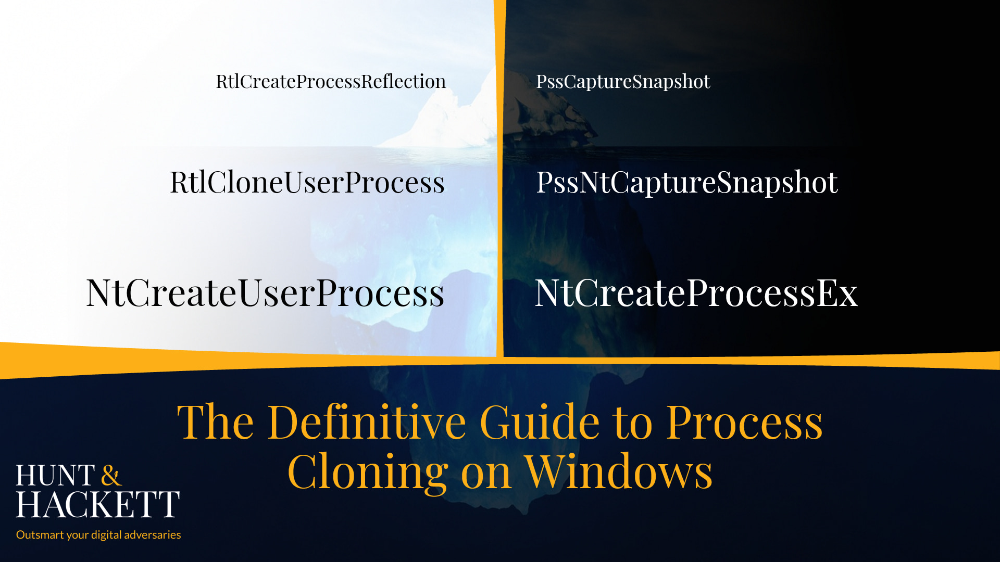
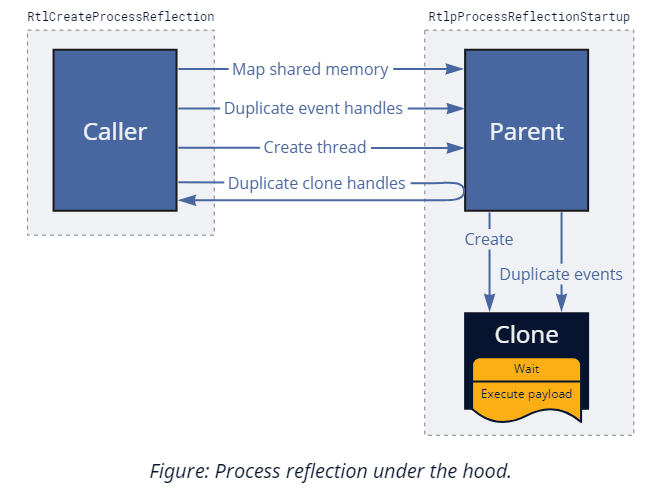
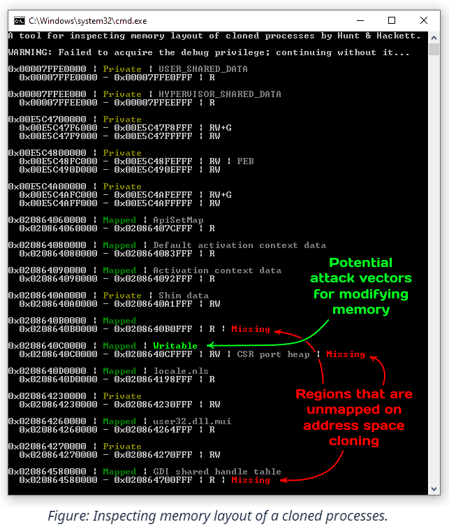
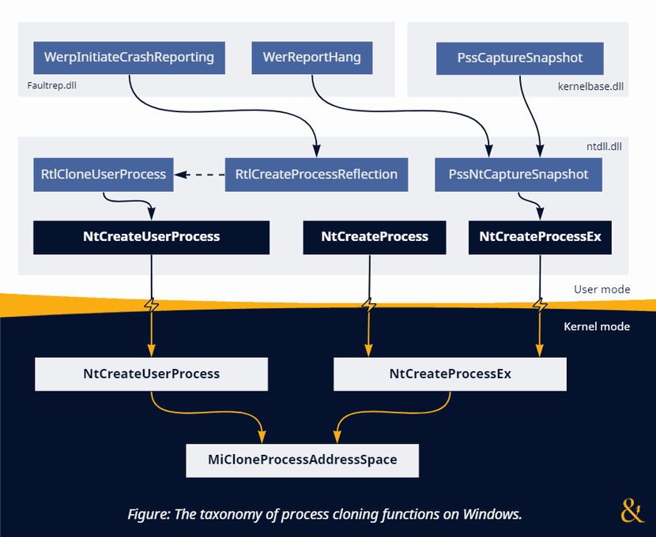

# The Definitive Guide To Process Cloning on Windows



While not everybody knows it, Windows natively offers functionality similar to the famous Unix `fork()` API. The primary OS mechanism that makes it possible is the support for **cloning the address space** of a given process. Despite its existence, this feature feels odd for an operating system that went for a completely different design path with process creation. And, as we know from experience in the cybersecurity industry, unusual often means untested, which serves as a great starting point for discovering new attack vectors that rely on abusing edge cases. That's why we often hear offers from security researchers to weaponize process cloning for offensive purposes, such as stealthy memory dumping [[1]](https://billdemirkapi.me/abusing-windows-implementation-of-fork-for-stealthy-memory-operations/), [[2]](https://splintercod3.blogspot.com/p/the-hidden-side-of-seclogon-part-2.html) and code injection [[3]](https://i.blackhat.com/EU-22/Thursday-Briefings/EU-22-Nissan-DirtyVanity.pdf). These ideas get exposure at the [top hacking conferences](https://www.blackhat.com/eu-22/briefings/schedule/index.html#dirty-vanity-a-new-approach-to-code-injection--edr-bypass-28417), so there seems to be potential.

This article aims to provide the reader with a **comprehensive guide** to the technical details and the underlying design decisions of process cloning on Windows and how they affect its usability. We will explore why most techniques for code injection via cloning will almost inevitably struggle with evading security products, yet other attack vectors like credential dumping might find their niche. There is a lot to cover, so let's dive right in!

> **Disclaimer:** the system functions (alongside their behavior) described below is officially undocumented and subject to potential (though unlikely) change. We assume that the myriad of pitfalls described below already serves as a good reason why, but let's stress it out: please, don't rely on them in production code!

# Recap: Process Creation

Windows provides a handful of documented ways for starting new processes: [CreateProcess](https://learn.microsoft.com/en-us/windows/win32/api/processthreadsapi/nf-processthreadsapi-createprocessw), [ShellExecuteEx](https://learn.microsoft.com/en-us/windows/win32/api/shellapi/nf-shellapi-shellexecuteexw), [WMI](https://learn.microsoft.com/en-us/windows/win32/wmisdk/about-wmi)'s [Win32_Process.Create](https://learn.microsoft.com/en-us/windows/win32/cimwin32prov/create-method-in-class-win32-process), [CreateProcessWithLogon](https://learn.microsoft.com/en-us/windows/win32/api/winbase/nf-winbase-createprocesswithlogonw), [WinExec](https://learn.microsoft.com/en-us/windows/win32/api/winbase/nf-winbase-winexec) — you name it. Despite this seeming diversity, each one eventually calls [CreateProcessAsUser](https://learn.microsoft.com/en-us/windows/win32/api/processthreadsapi/nf-processthreadsapi-createprocessasuserw) (technically, `CreateProcessInternalW` implemented in kernelbase.dll), either directly or indirectly (i.e., via RPC). Going a bit lower, we reach the final stop before jumping into the kernel — **[`NtCreateUserProcess`](https://github.com/processhacker/phnt/blob/7c1adb8a7391939dfd684f27a37e31f18d303944/ntpsapi.h#L2201-L2216)** from ntdll.dll. Here are the most noticeable traits of this syscall:
- It **understands filenames** plus opens and **parses the executable** on our behalf.
- It automatically **writes process parameters** (command line arguments, current directory, environment variables, etc.) into the new process.
- It **always creates the initial thread**, automatically selecting stack size and entry point address.

Here is a snippet from the function's definition in [phnt](https://github.com/processhacker/phnt):

```c
typedef struct _PS_ATTRIBUTE
{
    ULONG_PTR Attribute; // Any of ~30 pre-defined PS_ATTRIBUTE_* values
    SIZE_T Size;
    ULONG_PTR Value;
    PSIZE_T ReturnLength;
} PS_ATTRIBUTE, *PPS_ATTRIBUTE;

typedef struct _PS_ATTRIBUTE_LIST
{
    SIZE_T TotalLength;
    PS_ATTRIBUTE Attributes[ANYSIZE_ARRAY];
} PS_ATTRIBUTE_LIST, *PPS_ATTRIBUTE_LIST;

NTSYSCALLAPI
NTSTATUS
NTAPI
NtCreateUserProcess(
    _Out_ PHANDLE ProcessHandle,
    _Out_ PHANDLE ThreadHandle,
    _In_ ACCESS_MASK ProcessDesiredAccess,
    _In_ ACCESS_MASK ThreadDesiredAccess,
    _In_opt_ POBJECT_ATTRIBUTES ProcessObjectAttributes,
    _In_opt_ POBJECT_ATTRIBUTES ThreadObjectAttributes,
    _In_ ULONG ProcessFlags, // PROCESS_CREATE_FLAGS_*
    _In_ ULONG ThreadFlags, // THREAD_CREATE_FLAGS_*
    _In_opt_ PRTL_USER_PROCESS_PARAMETERS ProcessParameters,
    _Inout_ PPS_CREATE_INFO CreateInfo,
    _In_opt_ PPS_ATTRIBUTE_LIST AttributeList
    );
```

As you can see, `NtCreateUserProcess` is a high-level API that supports [substantial customization](https://github.com/processhacker/phnt/blob/7c1adb8a7391939dfd684f27a37e31f18d303944/ntpsapi.h#L1847-L1881). Conveniently, it assumes reasonable defaults and can automatically infer almost everything it needs. So, while it might look intimidating, calling `NtCreateUserProcess` is not that complex, especially compared to other duties of `CreateProcess`, such as registering the new process with CSRSS.

Before the era of Windows Vista (when `NtCreateUserProcess` didn't exit), `CreateProcess` used to rely on a different syscall — **[`NtCreateProcessEx`](https://github.com/processhacker/phnt/blob/7c1adb8a7391939dfd684f27a37e31f18d303944/ntpsapi.h#L1252-L1265)**. This older alternative exists until this day, although it remains available primarily for backward compatibility and supporting minimal processes. Here are its most distinct features:
- Instead of files, `NtCreateProcessEx` **only accepts memory projection objects** internally called image sections.
- This API is **unaware of** such user-mode concepts as **process parameters** (the previously mentioned command line arguments and others), thus, requiring the caller to allocate and deliver them manually.
- It **does not create threads** — only the process itself, leaving the rest up to the caller.

The definition of this function looks innocently straightforward:

```c
NTSYSCALLAPI
NTSTATUS
NTAPI
NtCreateProcessEx(
    _Out_ PHANDLE ProcessHandle,
    _In_ ACCESS_MASK DesiredAccess,
    _In_opt_ POBJECT_ATTRIBUTES ObjectAttributes,
    _In_ HANDLE ParentProcess,
    _In_ ULONG Flags, // PROCESS_CREATE_FLAGS_*
    _In_opt_ HANDLE SectionHandle,
    _In_opt_ HANDLE DebugPort,
    _In_opt_ HANDLE TokenHandle,
    _Reserved_ ULONG JobMemberLevel
    );
```

> Technically, there is a pair of functions called `NtCreateProcess` and `NtCreateProcessEx`. But since the first one is merely a wrapper that invokes the second, we will refer to them as one.

Don't let the function prototype deceive you: using `NtCreateProcessEx` in place of `NtCreateUserProcess` requires a **significant amount of work** consisting of many additional steps, such as opening and parsing the PE file, adjusting PEB, and creating the initial thread. Still, in exchange for this extra complexity, `NtCreateProcessEx` offers unique capabilities that we can weaponize against security software.
You can read more about these techniques (and even find some demos) in the [Process Tampering section](https://www.huntandhackett.com/blog/concealed-code-execution-techniques-and-detection) of one of our previous blog posts.

Now, how does it all relate to cloning? The answer is simple: both syscalls support it, yet, with vastly different limitations. Shortly we will learn about the differences and how they affect various usage scenarios; for now, let's explore the role of inheritance in process creation. After all, what is cloning if not an extreme manifestation of resource inheritance?

# What Does A New Process Inherit

Process creation includes three roles — the *parent*, the *caller*, and the *child*:

1. The **child** is the new process we create.
2. The **caller** is whoever invokes the process creation routine and, thus, is the one who controls which executable to run, its arguments, environment variables, and other parameters specified upon creation. The caller also determines which process to assign as a parent. Once the system creates the child, the caller gets handles to it and its initial thread.
3. The **parent** is the process that supplies the defaults for most inheritable properties (like handles) discussed below. Usually, the caller and the parent are one entity, but they don't have to be. In case of a mismatch, we say that the caller uses re-parenting. Of course, specifying another process as a parent requires opening it for `PROCESS_CREATE_PROCESS` (part of `GENERIC_WRITE` access), both when using the modern `NtCreateUserProcess` and the legacy `NtCreateProcessEx` syscalls.


Looking at the things that the child inherits from the parent, we can highlight a few properties:

- **[Security context](https://learn.microsoft.com/en-us/windows/win32/secauthz/access-tokens)**. Here, the caller has two options: explicitly provide a token, or let the child inherit one from the parent. The rules for token inheritance have a few caveats, but generally, the child receives an identical copy of the parent's token. There are some exceptions (the no-child-process flags, trust levels, mandatory labels, security attributes, etc.), but they are all out of the scope of the discussion. This feature is supported by both process creation methods, despite the information you might find on the internet that comes from an outdated definition for `NtCreateProcess[Ex]`.

- **[Handles](https://learn.microsoft.com/en-us/windows/win32/sysinfo/kernel-objects)**. The system can copy references to kernel objects from the parent's to the child's handle table. Again, the caller chooses whether to enable/disable this feature and, in the case of `NtCreateUserProcess`, can even narrow it down to a subset of entries. Keep in mind that copying only applies to handles already marked as inheritable. Although it is easy for a process to temporarily change the inheritance mode for any of its handles via [`NtSetInformationObject`](https://github.com/processhacker/phnt/blob/7c1adb8a7391939dfd684f27a37e31f18d303944/ntobapi.h#L142-L150), it might not be so trivial to achieve during re-parenting.

- **[Job object](https://learn.microsoft.com/en-us/windows/win32/procthread/job-objects)**, or the lack of one. Depending on the limitations configured on the parent's job, this feature might be either advantageous or unfavorable. Sometimes, the caller can request to break away the child from the job, which requires a special flag or system-level permissions. Alternatively, the caller can also put the child into more jobs — directly during creation with `NtCreateUserProcess` or post-factum via [`NtAssignProcessToJobObject`](https://learn.microsoft.com/en-us/windows/win32/api/jobapi2/nf-jobapi2-assignprocesstojobobject).

- **[Virtual address space](https://learn.microsoft.com/en-us/windows/win32/memory/virtual-address-space)**. That's where things get interesting. Instead of initializing a clean memory for the child (and mapping its image there), the new process (called a clone in this case) receives a replica of the parent's address space. That includes duplicating all private pages plus most of the mapped memory regions. Because this feature is incompatible with selecting another executable, both `NtCreateUserProcess` and `NtCreateProcessEx` use this mode when the caller doesn't provide a filename or section object on input.

But enough theory. We will discuss the exact rules of address space inheritance (that makes the bulk of cloning) in more detail later; for now, we are ready to start experimenting.

# Cloning for Execution

*Cloning offers a peculiar primitive*: it allows executing code in a temporary process identical to ours while skipping its initialization. In other words, if you don't have control over the `main()` function (because your code is merely part of a library, for example) and, therefore, cannot introduce custom startup arguments, yet, have to perform a simple operation that requires a new process, cloning seems like an ideal candidate. Just beware that you might be asking for too much if you want to use it in complex scenarios like for parallel handling of client requests or isolating browser tabs. Process cloning is certainly not free from caveats, which we will address shortly.

## NtCreateUserProcess

The recipe for cloning the current process with `NtCreateUserProcess` is exceedingly simple: don't specify the **image filename** (which usually comes as one of the Ps- attributes) and ignore the `ProcessParameters` argument.

```c
PS_CREATE_INFO createInfo = { sizeof(createInfo) };
HANDLE processHandle;
HANDLE threadHandle;

NTSTATUS status = NtCreateUserProcess(
    &processHandle,
    &threadHandle,
    PROCESS_ALL_ACCESS,
    THREAD_ALL_ACCESS,
    NULL,                                 // ProcessObjectAttributes
    NULL,                                 // ThreadObjectAttributes
    PROCESS_CREATE_FLAGS_INHERIT_HANDLES, // ProcessFlags
    0,                                    // ThreadFlags
    NULL,                                 // ProcessParameters
    &createInfo,                          
    NULL                                  // AttributeList
);
```

Of course, you can make it more complex by specifying non-conflicting Ps- attributes or overriding security descriptors, but you don't have to. As mentioned earlier, this syscall is quite intelligent — in addition to creating the process object (which, in this case, comes with a copy of our address space), it also **clones the current thread**. Naturally, this new thread continues executing (in a world almost indistinguishable from ours) right after exiting from the syscall.

> Technically, the cloned thread starts in `LdrInitializeThunk` (just like any other thread). But it hardly matters because it skips loader initialization and quickly jumps back to the next instruction after the syscall.

The semantic of using process cloning on Windows, therefore, becomes virtually identical to calling `fork()` on Unix-like systems:

```c
NTSTATUS status = NtCreateUserProcess(...);

if (status == STATUS_PROCESS_CLONED)
{
    // Executing in the clone/child
}
else
{
    // Executing in the parent/caller
}
```

To allow threads to tell each other apart, `NtCreateUserProcess` returns a **special status**: the cloned one always gets `STATUS_PROCESS_CLONED` (a successful code of 0x00000129) while the original receives everything else. The system also automatically adjusts the [`ClientID`](https://github.com/processhacker/phnt/blob/7c1adb8a7391939dfd684f27a37e31f18d303944/ntpebteb.h#L285) field in the new thread's [TEB](https://learn.microsoft.com/en-us/windows/win32/debug/thread-environment-block--debugging-notes-) (which remains at the same address) so that [`GetCurrentProcessId`](https://learn.microsoft.com/en-us/windows/win32/api/processthreadsapi/nf-processthreadsapi-getcurrentprocessid) and [`GetCurrentThreadId`](https://learn.microsoft.com/en-us/windows/win32/api/processthreadsapi/nf-processthreadsapi-getcurrentthreadid) continue returning relevant information. It also sets two other flags: [`InheritedAddressSpace`](https://github.com/processhacker/phnt/blob/7c1adb8a7391939dfd684f27a37e31f18d303944/ntpebteb.h#L71) in PEB and [`ClonedThread`](https://github.com/processhacker/phnt/blob/7c1adb8a7391939dfd684f27a37e31f18d303944/ntpebteb.h#L429) in TEB. The first one is used and cleared internally by `LdrpInitialize`; the second remains set and further allows distinguishing the clone from the parent.

You can find the demo program that clones itself via `NtCreateUserProcess` in the [dedicated section](https://github.com/huntandhackett/process-cloning/blob/master/1.NtCreateUserProcess/main.c) of the repository.

## NtCreateProcessEx?

The first step of cloning the current process with `NtCreateProcessEx` is also simple — merely invoke the routine without specifying the **section handle**:

```c
OBJECT_ATTRIBUTES objAttr;
HANDLE hProcess;

InitializeObjectAttributes(&objAttr, NULL, 0, NULL, NULL);

NTSTATUS status = NtCreateProcessEx(
    &hProcess,
    PROCESS_ALL_ACCESS,
    &objAttr,
    NtCurrentProcess(),                   // ParentProcess
    PROCESS_CREATE_FLAGS_INHERIT_HANDLES,
    NULL,                                 // SectionHandle
    NULL,                                 // DebugPort
    NULL,                                 // TokenHandle
    0                                     // Reserved
);
```

The code above clones the process, but in contrast with `NtCreateUserProcess`, it doesn't clone the calling thread (or any threads, for that matter). Usually, we would continue by doing it ourselves using either of two options:
1. Using the modern [`NtCreateThreadEx`](https://github.com/processhacker/phnt/blob/7c1adb8a7391939dfd684f27a37e31f18d303944/ntpsapi.h#L2230-L2245) function that allocates a new TEB and stack and invokes the provided address.
2. Using the legacy [`NtCreateThread`](https://github.com/processhacker/phnt/blob/7c1adb8a7391939dfd684f27a37e31f18d303944/ntpsapi.h#L1445-L1457) API that allows repurposing existing stacks and starting with an [arbitrary context](https://learn.microsoft.com/en-us/windows/win32/api/processthreadsapi/nf-processthreadsapi-getthreadcontext). It does create a new TEB, nonetheless.

Unfortunately, it doesn't matter which method we prefer because the results will be identically disappointing: `STATUS_PROCESS_IS_TERMINATING`, or, in other words, "*An attempt was made to access an exiting process.*" The system considers the cloned threadless process as waiting for deletion and, thus, refuses to create threads in it – something we inevitably need to execute code. Sorry, but `NtCreateProcessEx`-based cloning is **incompatible with code execution**.

> Note that it wasn't always the case. The kernel allowed creating threads in such processes until Windows 8.1.

## RtlCloneUserProcess

Returning to `NtCreateUserProcess`, we should notice that ntdll offers several wrappers that call this syscall under the hood and simplify its usage: [`RtlCreateUserProcess`](https://github.com/processhacker/phnt/blob/7c1adb8a7391939dfd684f27a37e31f18d303944/ntrtl.h#L2745-L2759), [`RtlCreateUserProcessEx`](https://github.com/processhacker/phnt/blob/7c1adb8a7391939dfd684f27a37e31f18d303944/ntrtl.h#L2763-L2787), and [**`RtlCloneUserProcess`**](https://github.com/processhacker/phnt/blob/7c1adb8a7391939dfd684f27a37e31f18d303944/ntrtl.h#L2815-L2831). The first two don't support cloning because they always specify the filename; the third one, however, is entirely dedicated to this task:

```c
typedef struct _RTL_USER_PROCESS_INFORMATION
{
    ULONG Length;
    HANDLE ProcessHandle;
    HANDLE ThreadHandle;
    CLIENT_ID ClientId;
    SECTION_IMAGE_INFORMATION ImageInformation;
} RTL_USER_PROCESS_INFORMATION, *PRTL_USER_PROCESS_INFORMATION;

#define RTL_CLONE_PROCESS_FLAGS_CREATE_SUSPENDED 0x00000001
#define RTL_CLONE_PROCESS_FLAGS_INHERIT_HANDLES 0x00000002
#define RTL_CLONE_PROCESS_FLAGS_NO_SYNCHRONIZE 0x00000004

NTSYSAPI
NTSTATUS
NTAPI
RtlCloneUserProcess(
    _In_ ULONG ProcessFlags,
    _In_opt_ PSECURITY_DESCRIPTOR ProcessSecurityDescriptor,
    _In_opt_ PSECURITY_DESCRIPTOR ThreadSecurityDescriptor,
    _In_opt_ HANDLE DebugPort,
    _Out_ PRTL_USER_PROCESS_INFORMATION ProcessInformation
    );
```

As usually happens with wrappers, `RtlCloneUserProcess` doesn't offer the full customization potential of `NtCreateUserProcess`. For example, it doesn't support immediately putting the clone into a [job object](https://learn.microsoft.com/en-us/windows/win32/procthread/job-objects) — something that might be useful for improving stability. Luckily, [`NtAssignProcessToJobObject`](https://learn.microsoft.com/en-us/windows/win32/api/jobapi2/nf-jobapi2-assignprocesstojobobject) can achieve that after process creation. Another thing you might notice is that we cannot specify the token for the new process. However, it is not `RtlCloneUserProcess`'s fault — `PS_ATTRIBUTE_TOKEN` is incompatible with cloning even on `NtCreateUserProcess`'s level. Perhaps, that's because tokens also dictate the session to which the process belongs, and cross-session cloning is something the system cannot afford. And again, luckily, there is a workaround: we can use [`NtSetInformationProcess`](https://github.com/processhacker/phnt/blob/7c1adb8a7391939dfd684f27a37e31f18d303944/ntpsapi.h#L1359-L1367) with the [`ProcessAccessToken`](https://github.com/processhacker/phnt/blob/7c1adb8a7391939dfd684f27a37e31f18d303944/ntpsapi.h#L126) info class to change the clone's primary token (but not the session!) before it starts.

So, why is `RtlCloneUserProcess` useful when we already have the more flexible `NtCreateUserProcess`? The reason might be surprising: **we cannot re-implement its functionality**, at least not entirely and precisely. To shed some light on this statement, we can consider a quote from Microsoft Research's [paper](https://www.microsoft.com/en-us/research/uploads/prod/2019/04/fork-hotos19.pdf) that highlights the conceptual problems of Unix's `fork()`, many of which equally apply to Windows's process cloning:

> Any non-trivial OS facility must document its behaviour across a fork, and **user-mode libraries must be prepared for their state to be forked at any time**.

If you look closer at `RtlCloneUserProcess` under a decompiler, you'll see that unless the caller specifies the no-synchronize flag, the function **prepares the state of ntdll** for cloning. More specifically:
- It drains the thread pool work queue.
- It temporarily acquires a handful of synchronization locks: the loader lock, the PEB lock, the TLS and FLS locks, heap manager locks, etc.

Because most of these operations use unexported variables and functions, manually reproducing this behavior is problematic. That's why you should prefer calling `RtlCloneUserProcess` instead of `NtCreateUserProcess`.

You can find the demo program that clones itself via `RtlCloneUserProcess` in the [dedicated section](https://github.com/huntandhackett/process-cloning/blob/master/2.RtlCloneUserProcess/main.c) of the repository.

## The Myriads of Caveats

Does it mean we are safe with `RtlCloneUserProcess`, then? Not even close. The primary factor determining whether the cloned code will execute correctly or crash dramatically is the **variety of OS facilities** it uses. On the one side of the scale, take programs that are single-threaded implementations of pure mathematical algorithms. Such examples are as compatible with cloning as they can be because the complete state of the memory is enough for them to continue operating without drawbacks. On the extreme opposite side, you can imagine a muli-threaded GUI application that uses hardware acceleration. Any of these properties is [problematic](https://www.microsoft.com/en-us/research/uploads/prod/2019/04/fork-hotos19.pdf) even when forking on Unix-like systems; combined, plus used on Windows, they are a recipe for disaster.

So, let's walk through several categories of OS resources and document how they behave with cloning:

- First and foremost, we have **kernel handles**. Because the handle table is a per-process structure shared by all libraries loaded into the application, most entries inside are merely an implementation detail of somebody else's code. As previously mentioned, it's possible to [iterate through all handles](https://github.com/processhacker/phnt/blob/7c1adb8a7391939dfd684f27a37e31f18d303944/ntpsapi.h#L168) and [mark them as inheritable](https://github.com/processhacker/phnt/blob/7c1adb8a7391939dfd684f27a37e31f18d303944/ntobapi.h#LL52C39-L52C69). Once we clone the process, the OS copies the handles, preserving their indices. There is a problem, however: not all kernel types and handle instances support that. Notable examples of such exceptions include [exclusive handles](https://github.com/processhacker/phnt/blob/7c1adb8a7391939dfd684f27a37e31f18d303944/phnt_ntdef.h#L203), ALPC ports, and types protected by custom [Ob- callbacks](https://learn.microsoft.com/en-us/windows-hardware/drivers/ddi/wdm/nf-wdm-obregistercallbacks). These entries will leave vacant spots in the cloned handle table. So if we cannot duplicate such objects by other means, it might be a good idea to occupy the corresponding slots with placeholder objects solely to prevent accidental collisions and double-use.

- Secondly, there are **threads**. `NtCreateUserProcess` (and, subsequently, `RtlCloneUserProcess`) clones only the calling thread and not any other that might exist concurrently. As a general rule, the caller doesn't (and cannot) know the details about all threads in their process. Some might belong to Ntdll's thread pool, others to the runtime, shell extensions, 3rd-party libraries, security products, etc. It's usually safer to ignore them than to let them run uncontrolled. Note that cloning does copy stacks and TEBs of all threads, so if you ever want to try, [`NtCreateThread`](https://github.com/processhacker/phnt/blob/7c1adb8a7391939dfd684f27a37e31f18d303944/ntpsapi.h#L1445-L1457) can help since it supports reusing stacks and starting with arbitrary contexts. Additionally, there is an issue with existing [thread pools](https://learn.microsoft.com/en-us/windows/win32/procthread/thread-pools): they are not meant for sharing and will continue creating threads in the parent process even when used from the clone.

- Closely related to the previous item, there are problems with **synchronization primitives** that can result in deadlocks. First, our attempt to fix compatibility by inheriting as many handles as possible has a downside — it introduces oversharing of kernel synchronization objects. Acquiring shared [mutexes](https://learn.microsoft.com/en-us/windows/win32/sync/mutex-objects), [events](https://learn.microsoft.com/en-us/windows/win32/sync/event-objects), or [semaphores](https://learn.microsoft.com/en-us/windows/win32/sync/semaphore-objects) in the clone also contends with the parent and might even deadlock its threads. User-mode primitives such as [wait-on-address](https://learn.microsoft.com/en-us/windows/win32/api/synchapi/nf-synchapi-waitonaddress), [condition variables](https://learn.microsoft.com/en-us/windows/win32/sync/condition-variables), [SRW locks](https://learn.microsoft.com/en-us/windows/win32/sync/slim-reader-writer--srw--locks), and [critical sections](https://learn.microsoft.com/en-us/windows/win32/sync/critical-section-objects) are also not trouble-free. On modern versions of Windows, they rely on [`NtWaitForAlertByThreadId`](https://github.com/processhacker/phnt/blob/7c1adb8a7391939dfd684f27a37e31f18d303944/ntpsapi.h#L1672-L1678), and the IDs of cloned threads are different.

- Strictly speaking, the new process does not always inherit a precise replica of the parent's **address space**. The catch is with mapped and image-backed memory. [`NtMapViewOfSection`](https://learn.microsoft.com/en-us/windows-hardware/drivers/ddi/wdm/nf-wdm-zwmapviewofsection) has an argument called `InheritDispositon` that controls whether the system should share or unmap the memory view during cloning (note that the official documentation uses the term "child processes," which is, technically, incorrect because typical child processes don't inherit the address space). Even though most Win32 API functions ([`LoadLibrary`](https://learn.microsoft.com/en-us/windows/win32/api/libloaderapi/nf-libloaderapi-loadlibraryw), [`MapViewOfFileEx`](https://learn.microsoft.com/en-us/windows/win32/api/memoryapi/nf-memoryapi-mapviewoffileex), etc.) set it to `ViewShare`, some OS components can specify `ViewUnmap` instead. Notable examples include the CSR shared memory, CSR port heap, and GDI shared handle table. Luckily, this problem doesn't affect private regions and is otherwise predictable. Later in the text, we showcase a tool that inspects the layout of the address space of a given process and highlights problematic areas.

So, what is safe to call from the clone? At the very least, most **NT syscalls**. Of course, the OS offers many other higher-level abstractions that rely on the previous facilities, which we cannot exhaustively cover here. Here are some examples of what might work and what not:
- **Loading more DLLs** in the clone gets stuck on Ntdll's locks. Alternatively, if we instruct `RtlCloneUserProcess` to bypass synchronization, it crashes with an access violation on the CSR port heap. That's because resolving DLL dependencies requires generating [SxS activation contexts](https://learn.microsoft.com/en-us/windows/win32/sbscs/activation-contexts) [for redirection](https://learn.microsoft.com/en-us/windows/win32/sbscs/dll-com-redirection-on-windows) and, thus, calling into CSR. Therefore, make sure to load the necessary libraries beforehand. Generally, we should expect most functionality that internally uses activation contexts (like COM) to misbehave.
- Yet, some **RPC-based functions** might still work, provided the clone inherits enough handles. For instance, [SCM](https://learn.microsoft.com/en-us/windows/win32/services/service-control-manager), [LSA](https://learn.microsoft.com/en-us/windows/win32/secmgmt/lsa-policy), [SAM](https://github.com/processhacker/phnt/blob/7c1adb8a7391939dfd684f27a37e31f18d303944/ntsam.h), and [WinStation](https://github.com/processhacker/phnt/blob/7c1adb8a7391939dfd684f27a37e31f18d303944/winsta.h) API operate mostly correctly. That means we can control services, look up SIDs, perform logon, etc.
- **Console I/O** requires a slight notch in the form of re-attaching: [`FreeConsole`](https://learn.microsoft.com/en-us/windows/console/freeconsole) + [`AttachConsole(ATTACH_PARENT_PROCESS)`](https://learn.microsoft.com/en-us/windows/console/attachconsole) does the trick.
- **Window- and graphics-related APIs** are unlikely to work, at least because the new process skipped win32k initialization and is missing the GDI shared handle table. Sorry, but no easy `MessageBox`'es from clones.

# Cloning for Remote Execution

If the previous discussion hasn't demotivated you from continuing experimenting, we can take the next logical step and apply cloning to other processes. At first glance, it might appear we merely need to specify the parent process handle to make it happen. A keen reader might spot a conceptual problem: `NtCreateUserProcess` is supposed to create a thread (that's one of the rules), yet cloning the caller's thread cannot work because it belongs to the wrong process. Cloning any of the parent's existing (unrelated) threads would also be strange since we don't control them. Finally, the function prototype has no parameters for specifying the start address. It all suggests that `NtCreateUserProcess` **cannot clone other processes**. Indeed, trying to do so causes it to fail with `STATUS_INVALID_PARAMETER`.

## RtlCreateProcessReflection

Here comes the lifehack of system programming: if you cannot do something cross-process, create a remote thread and do it in-process. Welcome, [**`RtlCreateProcessReflection`**](https://github.com/processhacker/phnt/blob/7c1adb8a7391939dfd684f27a37e31f18d303944/ntrtl.h#L2851-L2878):

```c
#define RTL_PROCESS_REFLECTION_FLAGS_INHERIT_HANDLES 0x2
#define RTL_PROCESS_REFLECTION_FLAGS_NO_SUSPEND 0x4
#define RTL_PROCESS_REFLECTION_FLAGS_NO_SYNCHRONIZE 0x8
#define RTL_PROCESS_REFLECTION_FLAGS_NO_CLOSE_EVENT 0x10

typedef struct _RTLP_PROCESS_REFLECTION_REFLECTION_INFORMATION
{
    HANDLE ReflectionProcessHandle;
    HANDLE ReflectionThreadHandle;
    CLIENT_ID ReflectionClientId;
} RTLP_PROCESS_REFLECTION_REFLECTION_INFORMATION, *PRTLP_PROCESS_REFLECTION_REFLECTION_INFORMATION;

NTSYSAPI
NTSTATUS
NTAPI
RtlCreateProcessReflection(
    _In_ HANDLE ProcessHandle,
    _In_ ULONG Flags,
    _In_opt_ PVOID StartRoutine,
    _In_opt_ PVOID StartContext,
    _In_opt_ HANDLE EventHandle,
    _Out_opt_ PRTLP_PROCESS_REFLECTION_REFLECTION_INFORMATION ReflectionInformation
    );
```

Under the hood, this API performs the following sequence of operations involving three processes:

**Inside the caller**:
  1. It prepares and maps a shared memory region between the caller and the parent, passing the required parameters via an `RTLP_PROCESS_REFLECTION_CONTEXT` structure.
  2. It creates a few events for synchronizing between processes and duplicates them into the parent.
  3. It creates a thread in the parent on an unexported `RtlpProcessReflectionStartup` function and waits until this thread either exits or notifies us that the clone has started.
  4. It duplicates the process and thread handles of the clone from the parent into the caller and exits.

**Inside the parent**:
  1. After a bit of preparation, `RtlpProcessReflectionStartup` calls `RtlCloneUserProcess`.
  2. It duplicates event handles to the new process.
  3. Once the clone starts, it notifies the caller and exits.

**Inside the clone**:
  1. It waits on the user-provided event (if there is one).
  2. Depending on the flags, `RtlpProcessReflectionStartup` invokes the provided callback, suspends itself, or does nothing.
  3. After that, the clone terminates.



Under normal circumstances, `RtlCreateProcessReflection` (as well as the injected thread in the parent) should exit almost immediately without waiting for the clone to complete. We can summarize the logic this API executes inside the new process with the following code:

```c
if (Context->ReflectionStartEvent)
{
    // Wait on the user-provided event
    NtWaitForSingleObject(Context->ReflectionStartEvent, FALSE, NULL);
}

if (Context->ReflectionRoutine)
{
    // Invoke the user-provided callback
    Context->ReflectionRoutine(Context->ReflectionParameter);
}
else if ((Context->ReflectionFlags & RTL_PROCESS_REFLECTION_FLAGS_NO_SUSPEND) == 0)
{
    // Suspend the clone
    NtSuspendThread(NtCurrentThread(), NULL);
}

// Terminate once done
NtTerminateProcess(NtCurrentProcess(), STATUS_SUCCESS);
```

As a result of the implementation details we just discussed, this API requires opening the parent for `PROCESS_VM_OPERATION | PROCESS_CREATE_THREAD | PROCESS_DUP_HANDLE` access and has additional stability considerations. First, the parent needs to be ready to accept remote threads and cannot be [frozen by a job](https://github.com/diversenok/Suspending-Techniques#freezing-via-a-job-object) (an [execution power request](https://github.com/winsiderss/systeminformer/blob/0c9970e182f05009272d6f02b616a15c17ce0ddf/phlib/native.c#L14094-L14145) might solve the problem) or [a debugger](https://github.com/diversenok/Suspending-Techniques#suspend-via-a-debug-object). Secondly, because the injected (and subsequently cloned) thread [skips DLL attaching](https://github.com/processhacker/phnt/blob/7c1adb8a7391939dfd684f27a37e31f18d303944/ntpsapi.h#L2221), it [slightly limits](https://m417z.com/A-guest-in-another-process-a-story-of-a-remote-thread-crash/) the number of supported operations that are safe to perform in the clone.

Despite these challenges, [Windows Error Reporting](https://learn.microsoft.com/en-us/windows/win32/wer/about-wer) successfully relies on this function for asynchronously dumping and analyzing applications when they hang or encounter unhandled exceptions.

## Offensive Code Injection? Unlikely.

The recent Black Hat Europe 2022 held a talk about applying process cloning for offensive purposes called ["Dirty Vanity: A New Approach to Code Injection and EDR Bypass."](https://www.blackhat.com/eu-22/briefings/schedule/index.html#dirty-vanity-a-new-approach-to-code-injection--edr-bypass-28417) The speaker presented the research suggesting weaponizing the peculiarities of cloning for stealthy code injection. In this section, we will review this suggestion and discuss whether it's probable that we will see such techniques applied in the future.

To start with, let's summarize our previous findings:
1. `NtCreateProcessEx` can clone other processes but **doesn't allow creating threads**. The [takeaways slide](https://i.blackhat.com/EU-22/Thursday-Briefings/EU-22-Nissan-DirtyVanity.pdf) of Dirty Vanity suggests exploring `NtCreateProcessEx`-based execution primitives, which are, unfortunately, impossible according to our research.
2. `NtCreateUserProcess` allows executing code but **only works on the current process** due to conceptual limitations.

As the only workaround, we have `RtlCreateProcessReflection`, which can clone other processes "from the inside" via a remote thread. From the security perspective, it certainly offers a remarkable possibility but, at the same time, suffers from most of the shortcomings [typical for code injection](https://www.huntandhackett.com/blog/concealed-code-execution-techniques-and-detection#detection). **Gaining code execution in the clone requires first gaining execution in the parent**, which mostly defeats the purpose. We can hardly consider using `RtlCreateProcessReflection` a stealthy approach because it shares many detection vectors with popular offensive techniques:
- It opens a handle to another process (the parent), triggering the [Ob- callback](https://learn.microsoft.com/en-us/windows-hardware/drivers/ddi/wdm/nf-wdm-obregistercallbacks). In itself, this fact isn't problematic. However, the access mask that the function requests look suspiciously similar to the one necessary for shellcode or DLL injection and includes heavily monitored rights.
- It maps a memory region into a different process, triggering [EtwTi](https://undev.ninja/introduction-to-threat-intelligence-etw/). At least this region is not executable, lowering its chances of triggering behavioral alerts.
- It performs cross-process thread creation, triggering the [corresponding Ps- callback](https://learn.microsoft.com/en-us/windows-hardware/drivers/ddi/ntddk/nf-ntddk-pssetcreatethreadnotifyroutineex) and implying that we might attempt to compromise the parent process. Remote thread creation is a particularly invasive operation that alone might be enough to raise alerts.
- Other less suspicious indicators of compromise include anomalous process creation (typically caught via [another Ps- callback](https://learn.microsoft.com/en-us/windows-hardware/drivers/ddi/ntddk/nf-ntddk-pssetcreateprocessnotifyroutineex)) and remote process/thread handle duplication (again, visible via [Ob- callbacks](https://learn.microsoft.com/en-us/windows-hardware/drivers/ddi/wdm/ns-wdm-_ob_pre_duplicate_handle_information)).

As a result, EDRs that collect telemetry from sources capable of detecting classical DLL and shellcode injection should have no trouble seeing the underlying shenanigans required to achieve code injection via cloning. Of course, like any other new approach, Dirty Vanity breaks known and easily recognizable patterns and, thus, has a higher chance of success than classical techniques. Yet, we can argue that it doesn't offer severe improvements in counteracting runtime detection, making it merely slightly appealing for red-teaming applications. It's also worth mentioning that the outcome could've been drastically different (much in favor of undetectability) if `NtCreateProcessEx`-based cloning was compatible with execution like it was before Windows 8.1.

# Cloning for Memory Dumping

**Process cloning is quick** (usually taking the order of milliseconds). The reason is the [copy-on-write mechanism](https://devblogs.microsoft.com/oldnewthing/20220314-00/?p=106346) that allows duplicating the address space without immediately copying the underlying memory and storing the data twice. Beware that this feature works at the expense of extensive commit charge (which guarantees that the OS can always duplicate pages on demand), so it is still possible to exhaust system resources.

Effectively, cloning provides **lightweight checkpoints** that capture the state of a process's address space at a specific moment. As a result, this mechanism becomes convenient for debugging purposes. If we want to read and save huge chunks of memory (like when making [minidumps](https://learn.microsoft.com/en-us/windows/win32/debug/minidump-files)), it's usually better to work on suspended or frozen processes. That's because writing several hundred megabytes on the disk can be a lengthy operation, and performing it while the target is running introduces race conditions. Cloning offers a non-intrusive alternative to suspension because it allows operating in parallel with the target.

If we compare the API calls that make remote clone-based memory dumping possible, `NtCreateProcessEx` outmatches `RtlCreateProcessReflection` both in stability and stealthiness:
- It **doesn't intrude** into the target as opposed to reflection that can theoretically crash it.
- It **works on frozen** processes.
- It relies on **less-monitored rights** (child process creation vs. remote thread creation, memory modification, and handle duplication).
- It **doesn't trigger** [Ps- callbacks](https://learn.microsoft.com/en-us/windows-hardware/drivers/ddi/ntddk/nf-ntddk-pssetcreateprocessnotifyroutineex). Since `NtCreateProcessEx` doesn't insert the initial thread, the system doesn't notify drivers about the new (cloned) process.

With these advantages in mind, you can find blog posts from other security researchers [[1]](https://billdemirkapi.me/abusing-windows-implementation-of-fork-for-stealthy-memory-operations/), [[2]](https://splintercod3.blogspot.com/p/the-hidden-side-of-seclogon-part-2.html) that describe using `NtCreateProcessEx` for memory dumping. Interestingly, the required concepts (address space inheritance and the required access for it) have been documented more than two decades ago in [Gary Nebbett's book "Native API Reference"](https://www.google.com/books/edition/Windows_NT_2000_Native_API_Reference/Fp1ct-bKYdcC) from 2000. The book even provides a code sample for cloning/forking via `NtCreateProcess`, which (being the only process creation syscall at the time) permitted creating threads.

Here is a code snippet for dumping the memory of another process via cloning.

```c
CLIENT_ID clientId = { ... };
HANDLE hFile = { ... };

OBJECT_ATTRIBUTES objAttr;
InitializeObjectAttributes(&objAttr, NULL, 0, NULL, NULL);

// Open the target process
HANDLE hParent;
NTSTATUS status = NtOpenProcess(&hParent, PROCESS_CREATE_PROCESS, &objAttr, &clientId);

if (!NT_SUCCESS(status))
    return status;

// Clone it
HANDLE hClone;
status = NtCreateProcessEx(
    &hClone,
    PROCESS_ALL_ACCESS,
    &objAttr,
    hParent,  // ParentProcess
    0,        // Flags
    NULL,     // SectionHandle
    NULL,     // DebugPort
    NULL,     // TokenHandle
    0         // Reserved
);

if (!NT_SUCCESS(status))
    return status;

// Proceed reading clone's memory    
BOOL success = MiniDumpWriteDump(
    hClone,                 // hProcess
    0,                      // ProcessId
    hFile,                  // hFile
    MiniDumpWithFullMemory, // DumpType
    NULL,                   // ExceptionParam
    NULL,                   // UserStreamParam
    NULL                    // CallbackParam
);
```

You can find the complete version of [the code](https://github.com/huntandhackett/process-cloning/blob/master/3.CloneAndMinidump/main.c) and [the pre-compiled binary](https://github.com/huntandhackett/process-cloning/releases/tag/v1.0) in the dedicated sections of the repository:

Starting from Windows 8.1, Microsoft also offers a documented [**process snapshotting** API](https://learn.microsoft.com/en-us/windows/win32/api/_proc_snap/) that relies on `NtCreateProcessEx`-based cloning. This API helps retrieve, iterate, and save information about the target process. It's funny to think that anti-virus products that don't filter out or monitor `PROCESS_CREATE_PROCESS` access on LSASS (thus, allowing admins to leverage it for indirectly reading credentials) are, in fact, vulnerable to the officially documented memory dumping API. Internally, these documented Pss* exports (`PssCaptureSnapshot`, and co.) from kernel32/kernelbase are merely wrappers over NtPss* functions (`PssNtCaptureSnapshot`, etc.) from ntdll that do most of the heavy lifting.

# Memory Tampering & Troubleshooting

The previous section established that `PROCESS_CREATE_PROCESS` (aka. child process creation) access effectively includes `PROCESS_VM_READ` (remote memory reading) access. However, we haven't seen anybody mentioning another similar attack vector that allows a limited `PROCESS_VM_WRITE` primitive. The key to this idea is **writable mapped memory**. Remember the copy-on-write mechanism described earlier? It's important to understand that it only applies to private memory, plus otherwise merely presents an implementation detail. If there were no performance penalties, Microsoft could easily replace it with complete copying. Mapped memory, on the other hand, is designed for sharing and therefore works differently. When the clone inherits a mapped region, it uses the same underlying storage, assuming the view or allocation protection doesn't force the copy-on-write semantics. In other words, any inheritable writable view from the parent also allows writing from the clone and presents a potential attack surface. Unfortunately, such regions are not plentiful, but they are also not necessarily rare. For instance, many programs map files into their address space to perform simplified I/O. Cloning offers a potential backdoor for modifying these files without reopening them or directly writing into the target process.



We present a small tool shown in the screenshot above to help identify problematic regions both in terms of potential for exploitation and troubleshooting access violations. It clones a process of your choice and then compares the address space layouts, highlighting the differences. As always, you can find [the source code](https://github.com/huntandhackett/process-cloning/blob/master/4.InspectClonedMemory/main.c) and [the binary](https://github.com/huntandhackett/process-cloning/releases/tag/v1.0) in the dedicated sections of the repository.

# Conclusions

**Cloning** is the ultimate form of inheritance, an abstraction that breaks the principle of least privileges by trying to share as much as possible. In some cases, it serves as a pleasant benefit; in others — it is an undesirable attack vector. In any of them, it is a peculiar primitive worth investigating. We hope the behavior we documented in this (rather lengthy) blog post serves as a strong foundation for all further research on the topic. In addition to the previously mentioned examples and tools, we also share a [small library](https://github.com/huntandhackett/process-cloning/tree/master/5.Library) (that works on top of [PHNT headers](https://github.com/processhacker/phnt)) that might offer a convenient starting point for additional experimentation.


